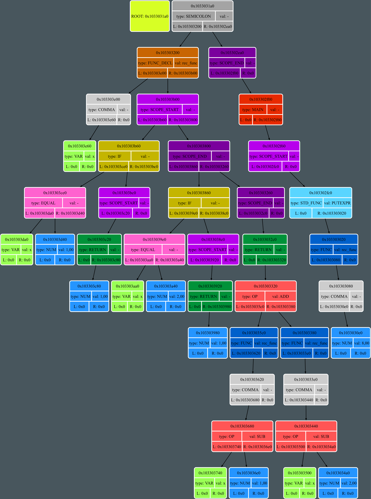

# Tatlang


A proprietary programming language that provides a full cycle of code processing:
- **Tokenization**: The process of breaking down the code into tokens.
- **Abstract Syntax Tree (AST) Formation**: Utilizing a recursive descent algorithm to construct the AST.
- **Assembly**: The conversion of the AST into assembly code.
- **Compilation**: The translation of assembly code into machine code.
- **Execution**: Running the compiled code.

## Key Features

- **Binary Tree Foundation**: The language is built upon a binary tree structure.
- **Custom Processor Emulator**: Employs a unique processor emulator for execution.
- **Graphical AST Representation**: Implemented using the DOT graph description language.
- **Adapted Syntax**: Tailored for the Tatar language, supporting all Unicode table symbols.

## Installation

### Dependencies

- **SFML Library**: To work with the virtual machine's video core

- **Graphviz Utility Package**: To visualize the abstract syntax tree.

**Clone** the repository using the following command in a directory of your choice:

```
git clone git@github.com:bulat1337/Tatlang.git
```

## Usage

1) Navigate to the `build` folder:

```
cd build
```

2) Inside the `build` folder, create a file with your code and the `.tat` extension.

3) Generate the executable file by running:

```
make
```


4) The executable will be located in the `executables` folder. You can run it without leaving the `build` folder by executing:

```
../executables/language_test.out *your code file name*
```


5) The result of executing your code will be stored in the `execution_result.txt` file in the `build` folder.

You can also use the `lan_sc` script (by editing the name of your code file within the script) like this:

```
./lan_sc
```

If you encounter permission issues, you can modify the permissions of the `lan_sc` script by running the following command while in the `build` folder:

```
chmod +rwx lan_sc
```


## How It Works

### Frontend

The frontend's primary task involves transforming code written in Tatlang into an Abstract Syntax Tree (AST).

Example of Code in Tatlang Language (Recursive Factorial):

```
# function declaration
белдерү rec_func(x)
{
	әгәр(x ≡ 1)
	{
		киребир 1;
	}

	әгәр(x ≡ 2)
	{
		киребир 1;
	}

	киребир rec_func(x - 1) + rec_func(x - 2);
}

# main function
рәис
{
	# function call
	мисалныяз(rec_func(8));
}

```

#### Tokenization

The Tatlang code, once written, is primarily processed by a tokenizer. This component filters out all extraneous elements—such as comments, spaces, empty lines, and more—ultimately presenting the code as a collection of tokens of various types.

#### Parsing Tokens

The parsing process involves handling tokens using a recursive descent algorithm. The parser constructs a tree based on the following syntax:

```

 Gen  ::= [Scope]+
	Scope ::= '{'{Scope}+'}' | Cmd
	Cmd   ::= Cond_Act | Asgn ';' | Std_Func ';' | Func_Decl | Func ';' | Ret ';' | Main
		Main      ::= "рәис" Scope
		Func_Decl ::= "белдерү" Id '(' Id | [Id ',']+ Id | _ ')' Scope
		Func      ::= Id( Expr | [Expr ',']+ Expr | _ )
		Ret       ::= "киребир" Expr
		Std_Func  ::= "алалмаш" '(' Id ')' | "мисалныяз" '(' Expr ')'
		Cond_Act  ::= ["булганда", "әгэә"] '(' Expr ')'  Scope
		Asgn      ::= Id '=' Expr
			Expr  ::= Mul{[+, -]Mul}* | Cond_Expr{[+, -]Cond_Expr}*
				Mul   		::= Par{[*, \]Par}*
				Cond_Expr	::= Par{[>, <, ≥, ≤, ≡, ≠]Par}*
			Par   ::= '('Expr')' | Num | Id | Unary | Func
			Unary ::= ["син", "кос", "лн", "тамырасты"] '(' Expr ')'
			Num   ::= ['0' - '9']+
			Id    ::= ['a' - 'z', 'A' - 'Z', '_', '$']['a' - 'z', 'A' - 'Z', '_', '$', '0' - '9']+

```

Example of the resulting tree:



### Midend

In the midend, syntax trees are simplified through two types of optimization: constant folding (e.g., 2 + 2 -> 4) and trivial mathematical expression resolution (e.g., 0 * variable_1 -> 0).

### Backend

The backend process involves generating assembly code from a simplified syntax tree, which serves as the foundation for the operation of the processor emulator.

#### Assembly

Based on the simplified syntax tree, assembly code is generated, which serves as the basis for the processor emulator's operation.

Example of Generated Code:

```
:rec_func
push 0
push 1,000000
push rbx
jne break_0
push 1
add
:break_0
push 0
add
push 0
je break_1
push 1,000000
pop rax
ret
:break_1
push 0
push 2,000000
push rbx
jne break_2
push 1
add
:break_2
push 0
add
push 0
je break_3
push 1,000000
pop rax
ret
:break_3
push rax
push rbx
push rbx
push 1,000000
sub
pop rbx
call rec_func
pop rbx
pop rcx
push rax
push rcx
pop rax
push rax
push rbx
push rcx
push rbx
push 2,000000
sub
pop rbx
call rec_func
pop rcx
pop rbx
pop rcx
push rax
push rcx
pop rax
add
pop rax
ret
ret
:main
push 8,000000
pop rbx
call rec_func
push rax
out
hlt

```

#### Compilation

The generated assembly code is compiled on the processor emulator, resulting in bytecode.

#### Execution

The resulting bytecode executes the processor.


# Acknowledgments

Special thanks to my mom for her assistance in developing the Tatar syntax for the language. =)

